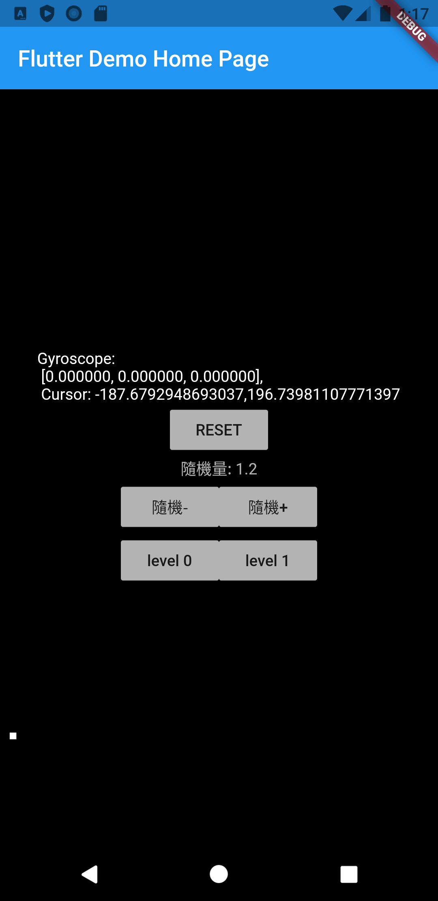

# gyro_to_xy
Flutter sample project to convert Gyro info to movement of a cursor on screen

拿系統給的Gyroscope數據轉換成滑鼠的 X Y座標

## Install and Build

1. Make sure you have Flutter set up and running, I recommend you use Android Studio for development.
If you don't, follow the instructions on [https://flutter.dev/docs/get-started/install](https://flutter.dev/docs/get-started/install).

  跟著[連結](https://flutter.dev/docs/get-started/install) 安裝Flutter。

2. Download everything, open the project in your Android Studio, follow the suggestions Android Studio gave you, and build the project on to your chosen device. 

  下載所有檔案，用Android Studio打開並build上你的移動設備。

3. Alternatively, create a new Flutter project, replace the `main.dart` with the `main.dart` here, 
then replace the dependencies bit of your `pubspec.yaml` file to 

  也可以自己新建一個乾淨的Flutter Project，把`main.dart` 換成下載下來的版本，然後更新你的`pubspec.yaml`中dependencies 的部分為：

```
dependencies:
  flutter:
    sdk: flutter
  sensors: ^0.4.2+6
```

## Usage

After building the app onto a mobile device, see if the little square move as you expect it does. 
If not, adjust global variables in the main.dart for your need.

確認上機使用符合預期，如不，調整 `main.dart` 裡面的參數。
 


